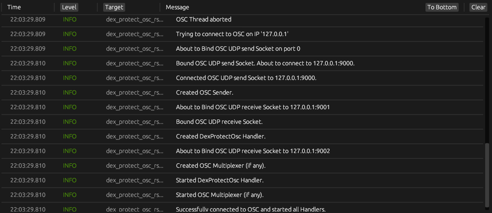

# Gui/Features

## DexProtect

Allows for using the [DexProtect](https://gum.co/DexProtect) plugin for [VRChat](https://vrchat.com).
Comparisons between the bundled OSC Application and this one:
Pros of using this App:
- You can possibly use it on a different computer than the one running VRChat (I haven't tested this, nor do I know if VRChat will actually Send OSC events over the network)
- You can use the `OSC Multiplexer` at the same time (see below for more info)
- All Code is Platform independent (there might be some dependencies that are not, but the code itself is)
- The code is Open Source. If you have the knowledge, you can check exactly what this Application is doing and/or build the app for yourself.

Cons:
- The app uses a bit more CPU when moving the mouse (but still less/around 1% on my machine)
- The app is a bit larger in disk size (this app is ~8MB, the bundled one is ~100KB).

## OSC Multiplexer

This Module allows for using multiple OSC Applications that send data at the same time.
This works by forwarding all messages, OSC or otherwise, received on the set `OSC Multiplexer` ports (viewable and configurable under the `Manage Ports` button) to the `OSC Send` port.

## Logs

This is the Log section of the GUI (actual log messages may differ depending on the version, but the overall design should be the same)

It shows all logs that are generated by the application.
This can be useful for debugging sometimes, e.g. seeing if DexProtect is working correctly and unlocking avatars.
Logs are currently not saved to disk, and I don't see why I should.

A known issue with the Logs module is, that when scrolling all the way to the bottom it will wiggle up and down a bit sometimes.
If that happens, just scroll up, so you are not on the very bottom anymore and the wiggling should stop.

# Notes
- The Application doesn't handle one Udp Packet containting multiple OSC Packets well.
- The Osc Multplexer might interact wierdly with raw message forwarding. Some bits of packets might be sent multiple times in a row in certain situations.
